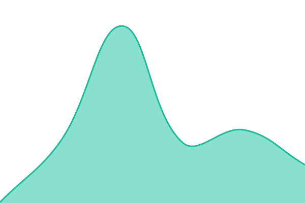

# [📈 Statut en direct](https://undefined.github.io/undefined): <!--live status--> **Tous les systèmes opérationnels**

This repository contains the open-source uptime monitor and status page for [undefined](https://undefined.github.io/undefined), powered by [Upptime](https://github.com/upptime/upptime).

With [Upptime](https://upptime.js.org), you can get your own unlimited and free uptime monitor and status page, powered entirely by a GitHub repository. We use [Issues](https://github.com/undefined/undefined/issues) as incident reports, [Actions](https://github.com/undefined/undefined/actions) as uptime monitors, and [Pages](https://undefined.github.io/undefined) for the status page.

## [📈 Live Status](https://demo.upptime.js.org): <!--live status--> **Tous les systèmes opérationnels**

<!--start: status pages-->
<!-- This summary is generated by Upptime (https://github.com/upptime/upptime) -->
<!-- Do not edit this manually, your changes will be overwritten -->
<!-- prettier-ignore -->
| URL | Status | History | Temps de réponse | Uptime |
| --- | ------ | ------- | ------------- | ------ |
|  [Vibe Coders Manual](https://vibe-coders-manual.vercel.app) | Opérationnel | [vibe-coders-manual.yml](https://github.com/ewlbasco/uptime-monitor/commits/HEAD/history/vibe-coders-manual.yml) | 

 115ms
     
 | 

<a href="https://undefined.github.io/undefined/history/vibe-coders-manual">100.00%</a>
    

|  [Client Account Management](https://client-account-management.vercel.app) | Opérationnel | [client-account-management.yml](https://github.com/ewlbasco/uptime-monitor/commits/HEAD/history/client-account-management.yml) | 

 123ms
     
 | 

<a href="https://undefined.github.io/undefined/history/client-account-management">100.00%</a>
    

<!--end: status pages-->

[**Visit our status website →**](https://undefined.github.io/undefined)

## 📄 License

- Powered by: [Upptime](https://github.com/upptime/upptime)
- Code: [MIT](./LICENSE) © [Anand Chowdhary](https://anandchowdhary.com)
- Data in the `./history` directory: [Open Database License](https://opendatacommons.org/licenses/odbl/1-0/)
